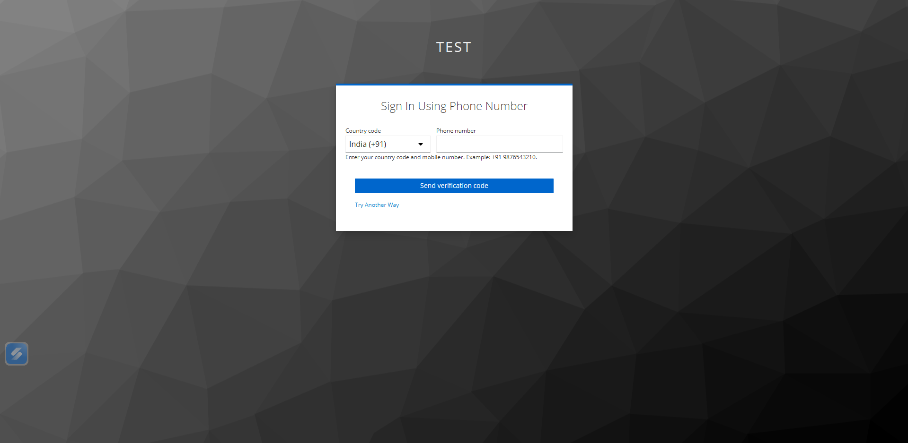
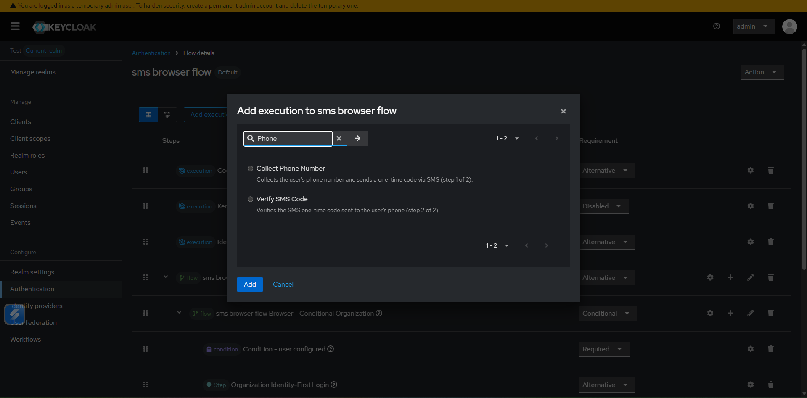
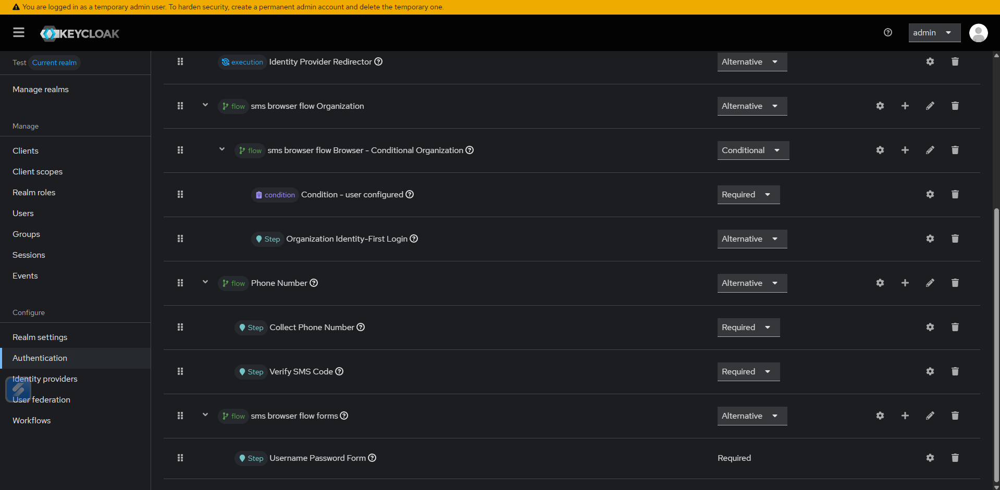

# Keycloak Phone Verification

Phone-number-first authentication for Keycloak using SMS OTP delivered through Twilio Verify.

This project adds:

- `Collect Phone Number`
- `Verify SMS Code`
- `phone_otp` direct grant type
- `phone-verification/request-otp` realm API endpoint

The result is a login flow where users enter a phone number, receive a one-time code by SMS, and complete sign-in without a username/password form.

## Screenshots

### Phone Entry



### OTP Verification


### Keycloak Flow Configuration



### Keycloak Flow Configuration Example



## Why This Project

- Phone-first login experience for browser authentication flows
- Twilio Verify integration for OTP delivery and validation
- Automatic phone normalization to E.164 format
- Automatic user lookup by phone number
- Automatic zero-friction user auto-provisioning when no account exists
- Configurable resend cooldown, resend limit, and invalid-attempt limit
- Previous verification invalidated on resend to reduce stale-code reuse
- API-based OTP request plus token issuance for mobile or backend clients

## How It Works

1. The user enters a phone number.
2. The provider normalizes it to E.164 format.
3. The provider looks for an existing Keycloak user by:
   - username equal to the normalized phone number
   - user attribute `phoneNumber`
   - user attribute `phone`
4. If no user exists, a new enabled user is created automatically.
5. Twilio Verify sends the SMS code.
6. The user submits the OTP.
7. Twilio Verify validates the code and the browser flow completes.

For API clients, the flow is:

1. Call the OTP request endpoint with `client_id`, optional `client_secret`, and `phone_number`.
2. Receive the SMS code.
3. Call the token endpoint with `grant_type=phone_otp`, `client_id`, optional `client_secret`, `phone_number`, and `otp`.
4. Keycloak validates the OTP and returns tokens.

## Compatibility

| Component | Version |
| --- | --- |
| Java | 17 |
| Maven | 3.9+ recommended |
| Keycloak | 26.6.0 |
| OTP backend | Twilio Verify |

## Configuration

The provider reads Twilio settings from environment variables at runtime.

| Variable | Required | Default | Description |
| --- | --- | --- | --- |
| `OTP_PROVIDER` | No | `twilio` | OTP provider selector. The current implementation supports Twilio. |
| `TWILIO_ACCOUNT_SID` | Yes | none | Twilio account SID. |
| `TWILIO_AUTH_TOKEN` | Yes | none | Twilio auth token. |
| `TWILIO_SERVICE_SID` | Yes | none | Twilio Verify service SID. |

### Authenticator Execution Settings

#### `Collect Phone Number`

| Setting | Default | Description |
| --- | --- | --- |
| `Default Country Code` | `+91` | Applied when the user enters a local number without an explicit country code. |

#### `Verify SMS Code`

| Setting | Default | Description |
| --- | --- | --- |
| `Max OTP Attempts` | `5` | Maximum number of incorrect OTP submissions before the flow is blocked. |
| `Resend Cooldown (seconds)` | `60` | Minimum wait time before another OTP can be requested. |
| `Max Resend Attempts` | `3` | Maximum number of resend actions per authentication session. |

## Build

Build the shaded provider JAR:

```bash
mvn clean package -DskipTests
```

Output artifact:

```text
target/phone-verification-authenticator-1.0.0.jar
```

The shaded build excludes Jackson classes so it can coexist more safely with Keycloak's runtime libraries.

## Use The Release Package

If you do not want to build from source, use the packaged JAR from the repository's GitHub Releases page.

### Download

1. Open the repository `Releases` page on GitHub.
2. Select the latest release or the version you want.
3. Download the provider JAR asset:

```text
phone-verification-authenticator-<version>.jar
```

Do not use files named `original-*.jar`; use the packaged release JAR.

### Install

1. Copy the downloaded JAR into Keycloak's `providers/` directory.
2. Run a Keycloak build.
3. Start or restart Keycloak.

Example:

```bash
cp phone-verification-authenticator-<version>.jar /opt/keycloak/providers/
/opt/keycloak/bin/kc.sh build
/opt/keycloak/bin/kc.sh start
```

### Configure Runtime Environment

Set the required Twilio environment variables before starting Keycloak:

```bash
export OTP_PROVIDER=twilio
export TWILIO_ACCOUNT_SID=ACxxxxxxxxxxxxxxxxxxxxxxxxxxxxxxxx
export TWILIO_AUTH_TOKEN=your_auth_token
export TWILIO_SERVICE_SID=VAxxxxxxxxxxxxxxxxxxxxxxxxxxxxxxxx
```

After Keycloak starts, configure the browser flow in the admin console using the steps in [Keycloak Setup](#keycloak-setup).

## Install In Keycloak

1. Build the JAR.
2. Copy it into Keycloak's `providers/` directory.
3. Rebuild Keycloak.
4. Start or restart Keycloak.

Example:

```bash
cp target/phone-verification-authenticator-1.0.0.jar /opt/keycloak/providers/
/opt/keycloak/bin/kc.sh build
/opt/keycloak/bin/kc.sh start
```

Example with environment variables:

```bash
export OTP_PROVIDER=twilio
export TWILIO_ACCOUNT_SID=ACxxxxxxxxxxxxxxxxxxxxxxxxxxxxxxxx
export TWILIO_AUTH_TOKEN=your_auth_token
export TWILIO_SERVICE_SID=VAxxxxxxxxxxxxxxxxxxxxxxxxxxxxxxxx

/opt/keycloak/bin/kc.sh start
```

## Keycloak Setup

### 1. Create a Dedicated Browser Flow

In the Keycloak admin console:

1. Open `Authentication`.
2. Open `Flows`.
3. Copy the built-in `browser` flow.
4. Give the copy a clear name such as `browser-phone-login`.

Do not modify the built-in `browser` flow directly.

### 2. Add the Provider Executions

Inside the copied flow:

1. Add execution `Collect Phone Number`.
2. Set it to `REQUIRED`.
3. Add execution `Verify SMS Code`.
4. Set it to `REQUIRED`.

Recommended order:

1. `Collect Phone Number`
2. `Verify SMS Code`

If the copied flow still contains username/password steps, remove or disable them if the goal is phone-only sign-in.

### 3. Configure Execution Options

For `Collect Phone Number`, configure:

- `Default Country Code`

For `Verify SMS Code`, configure:

- `Max OTP Attempts`
- `Resend Cooldown (seconds)`
- `Max Resend Attempts`

### 4. Bind The Flow

1. Open `Authentication`.
2. Open `Bindings`.
3. Set `Browser Flow` to your copied flow.
4. Save.

## Direct Access Grant API

The provider now supports an API-driven phone login that mirrors direct access grants.

Requirements:

- the client must use protocol `openid-connect`
- `Direct Access Grants Enabled` must be turned on for the client
- confidential clients must send `client_secret`

### 1. Request OTP

Endpoint:

```text
POST /realms/{realm}/phone-verification/request-otp
```

Form fields:

- `client_id` required
- `client_secret` required for confidential clients
- `phone_number` required
- `country_code` optional, for local numbers such as `+91`

Example:

```bash
curl -X POST "http://localhost:8080/realms/myrealm/phone-verification/request-otp" \
  -H "Content-Type: application/x-www-form-urlencoded" \
  -d "client_id=my-client" \
  -d "client_secret=my-secret" \
  -d "phone_number=9876543210" \
  -d "country_code=+91"
```

### 2. Exchange Phone + OTP For Tokens

Endpoint:

```text
POST /realms/{realm}/protocol/openid-connect/token
```

Form fields:

- `grant_type=phone_otp`
- `client_id` required
- `client_secret` required for confidential clients
- `phone_number` required
- `otp` required
- `country_code` optional
- `scope` optional

Example:

```bash
curl -X POST "http://localhost:8080/realms/myrealm/protocol/openid-connect/token" \
  -H "Content-Type: application/x-www-form-urlencoded" \
  -d "grant_type=phone_otp" \
  -d "client_id=my-client" \
  -d "client_secret=my-secret" \
  -d "phone_number=9876543210" \
  -d "country_code=+91" \
  -d "otp=123456" \
  -d "scope=openid profile email"
```

Notes:

- the OTP request is tracked per realm, client, and normalized phone number
- resend cooldown, resend limit, and max invalid-attempt limit use the same defaults as the browser flow
- user lookup and auto-provisioning are the same as the browser flow

## User Resolution And Provisioning

When a phone number is submitted, the provider resolves a user in this order:

1. Username equals the normalized phone number
2. User attribute `phoneNumber`
3. User attribute `phone`
4. Auto-create a new enabled user

Auto-created users:

- use the normalized phone number as the username
- are marked enabled
- receive `phoneNumber=<normalized phone>`

This behavior is built into the current implementation. There is no toggle yet to disable auto-provisioning.

## OTP Session Behavior

The authentication session stores:

- normalized phone number
- OTP sent timestamp
- resend count
- invalid OTP attempt count
- active Twilio verification SID

On resend, the provider:

1. checks cooldown and resend limits
2. cancels the previous Twilio verification when possible
3. sends a new OTP
4. resets invalid-attempt count
5. stores the new verification SID

This is important because it reduces the chance that an older verification remains usable after a resend.

## Project Layout

- [`pom.xml`](./pom.xml) contains the Maven build and shaded-jar packaging.
- [`src/main/java/dev/bhupender/smsauth/authenticator`](./src/main/java/dev/bhupender/smsauth/authenticator) contains the Keycloak authenticators and factories.
- [`src/main/java/dev/bhupender/smsauth/service`](./src/main/java/dev/bhupender/smsauth/service) contains the OTP service abstraction and Twilio integration.
- [`src/main/resources/theme-resources/templates`](./src/main/resources/theme-resources/templates) contains the custom login templates.
- [`src/main/resources/theme-resources/messages/messages_en.properties`](./src/main/resources/theme-resources/messages/messages_en.properties) contains the default UI strings.
- [`.github/workflows/release.yml`](./.github/workflows/release.yml) contains the GitHub Actions release workflow.

## Troubleshooting

### Provider Does Not Appear In Keycloak

- Confirm the JAR is inside Keycloak's `providers/` directory.
- Run `kc.sh build` after copying the JAR.
- Restart Keycloak after rebuilding.
- Check logs for SPI loading errors.
- Confirm the provider was built against Keycloak `26.6.0`.

### SMS Is Not Sent

- Verify `TWILIO_ACCOUNT_SID`, `TWILIO_AUTH_TOKEN`, and `TWILIO_SERVICE_SID`.
- Confirm the Twilio Verify service exists and is active.
- Check Keycloak logs for Twilio API errors.
- Make sure the phone number is being normalized into valid E.164 format.

### OTP Verification Fails Repeatedly

- Confirm the user is entering the latest OTP after any resend.
- Check whether the invalid-attempt limit has been reached.
- Check whether the code has expired in Twilio Verify.
- Inspect Keycloak logs for Twilio verification errors.

### Resend Does Not Work

- Confirm the resend cooldown has elapsed.
- Confirm the session has not reached the maximum resend limit.
- Check logs for Twilio cancellation or resend errors.

## Current Scope And Limitations

- The current provider implementation is Twilio-specific.
- The project supports browser flows and a custom direct grant style API.
- There are no automated tests in this repository yet.
- Auto-provisioning is always enabled in the current implementation.
